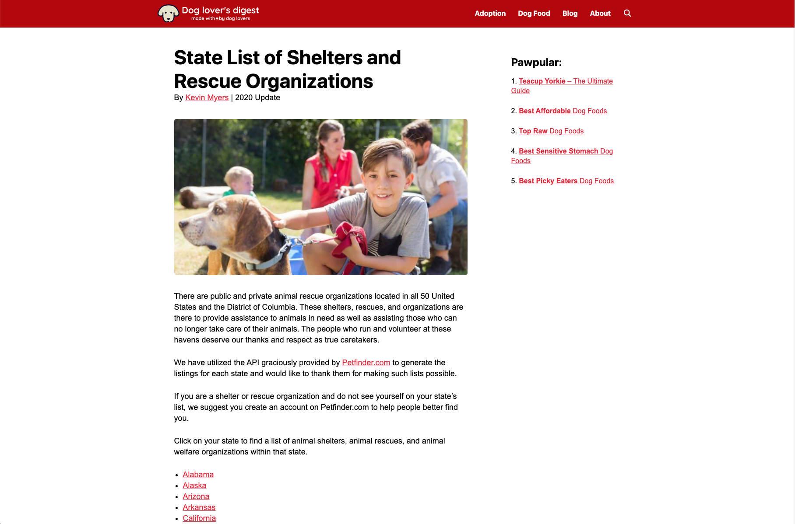
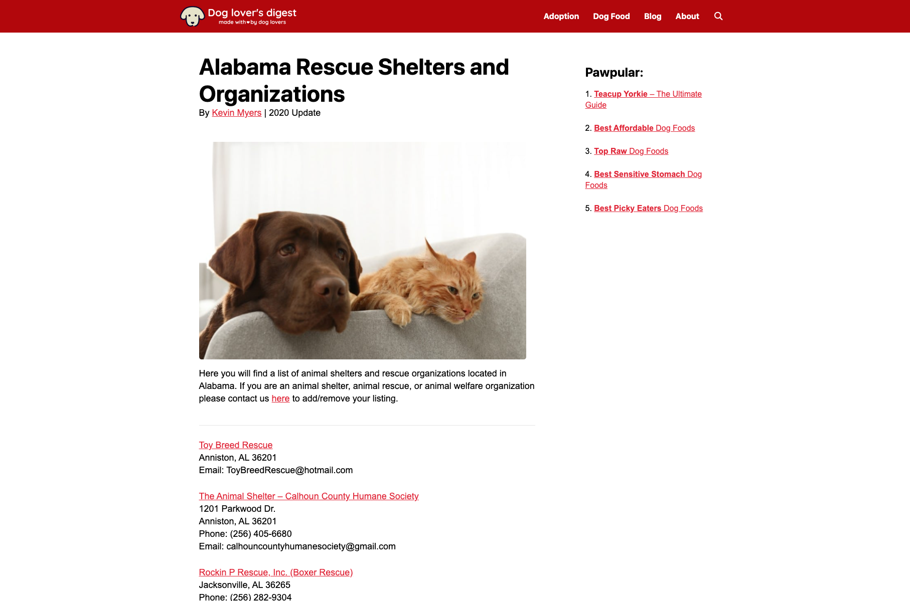
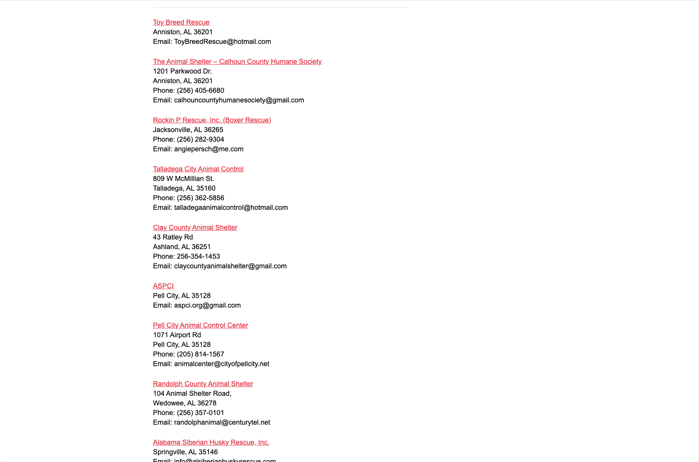
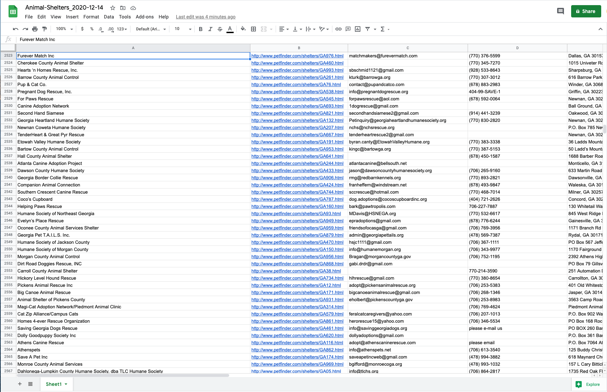
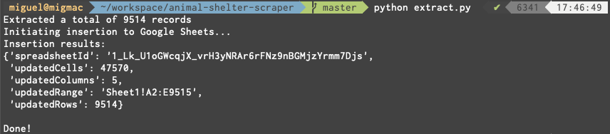

# Animal Shelter Scraper

This is a small script that extracts all the shelters information from [this website](https://www.dogloversdigest.com/adoption/state-list-of-shelters-and-rescue-organizations/) and inserts it into a private Google Sheet.

<p align="center">
    
    
    
    
    
</p>

## Pre-requisites
### Packages
```
beautifulsoup4==4.9.3
brotlipy==0.7.0
cachetools==4.2.0
certifi==2020.12.5
cffi==1.14.4
chardet==3.0.4
cryptography==3.3.1
google-api-core==1.24.0
google-api-python-client==1.12.8
google-auth==1.24.0
google-auth-httplib2==0.0.4
google-auth-oauthlib==0.4.2
googleapis-common-protos==1.52.0
httplib2==0.18.1
idna==2.10
oauthlib==3.1.0
pip==20.3.1
protobuf==3.14.0
pyasn1==0.4.8
pyasn1-modules==0.2.8
pycparser==2.20
pyopenssl==20.0.0
pysocks==1.7.1
python==3.9.1
pytz==2020.4
requests==2.25.0
requests-oauthlib==1.3.0
rsa==4.6
setuptools==51.0.0
six==1.15.0
soupsieve==2.1
uritemplate==3.0.1
urllib3==1.25.11
wheel==0.36.2
```
### Google API setup
Go to the [Google Sheets API Python Quickstart](https://developers.google.com/sheets/api/quickstart/python), head over to the "Step 1: Turn on the Google Sheets API" and click on the "Enable the Google Sheets API" button. Create a project (default is "Quickstart"), generate your keys and download the _credentials.json_ file (or rename it that way if it has a different name) and move it to the working directory.

Then, execute the following script on the same directory to create your _token.pickle_ file used by the main script:
```python
from googleapiclient.discovery import build
from google_auth_oauthlib.flow import InstalledAppFlow
scopes = [
    "https://www.googleapis.com/auth/drive",
    "https://www.googleapis.com/auth/drive.file",
    "https://www.googleapis.com/auth/spreadsheets"
]
flow = InstalledAppFlow.from_client_secrets_file('credentials.json', SCOPES)
credentials = flow.run_local_server(port=0)  # Opens a browser for authentication
with open('token.pickle', 'wb') as token:
    pickle.dump(credentials, token)  # Creates token.pickle file
```